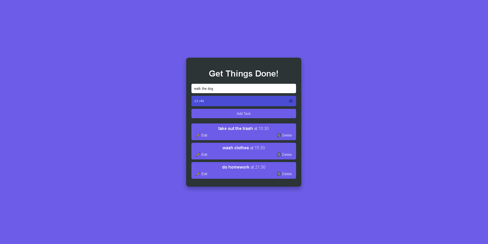

<h1>Descripción del proyecto</h1>
 
La aplicación tiene las siguientes características:
 
-Agregar tareas: El usuario puede introducir el nombre de una tarea y la hora en que debe realizarla.
 
-Editar tareas: Las tareas existentes pueden modificarse, permitiendo actualizar tanto el nombre como la hora.
 
-Eliminar tareas: Las tareas pueden eliminarse cuando ya no son necesarias.

